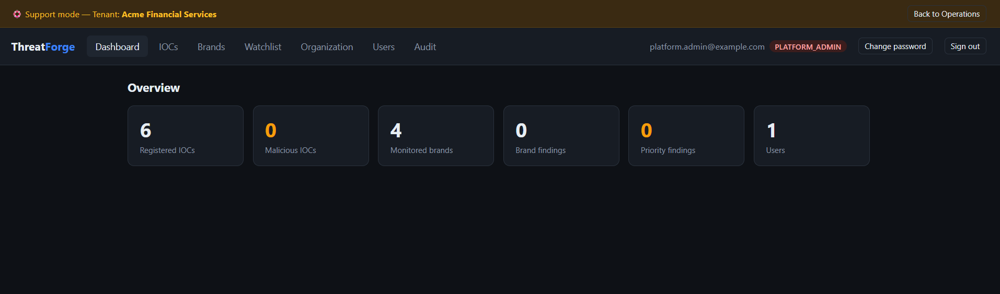
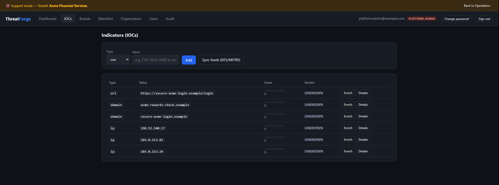
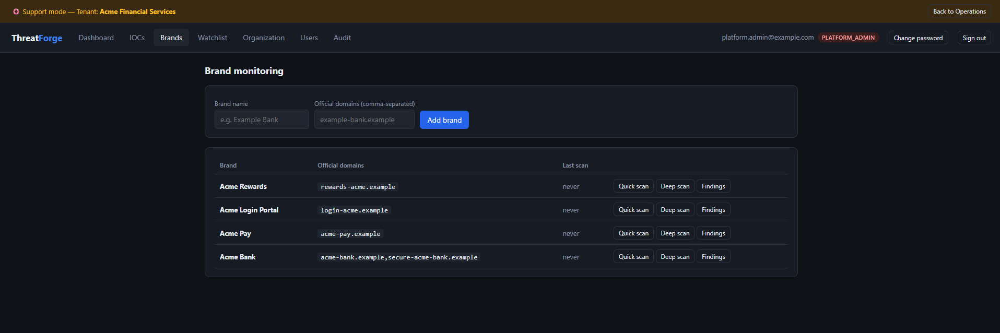
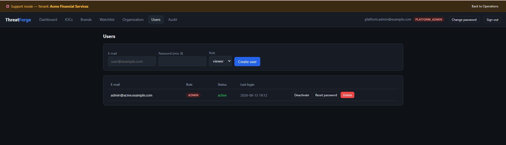
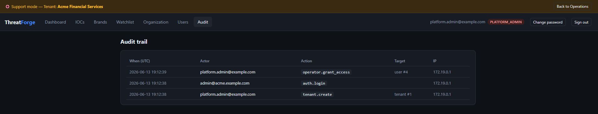
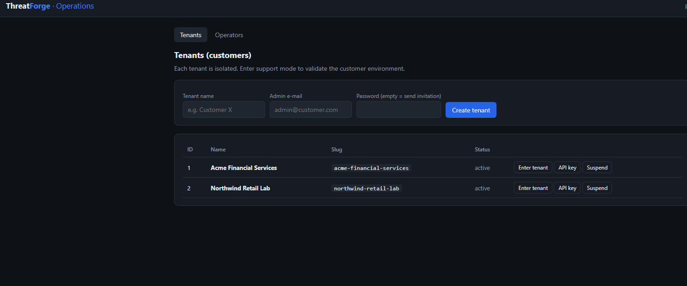

# ThreatForge

**Open Source Cyber Threat Intelligence and Digital Risk Protection Platform**

ThreatForge is an open source platform for Cyber Threat Intelligence, Digital Risk Protection and digital risk investigation. It helps security analysts, SOC teams, fraud teams and researchers organize indicators, enrich observables, monitor brand abuse, prioritize risk and generate actionable intelligence.

## Release status

**Current release: v0.10.0 — Community Preview** (AGPL-3.0-or-later).
This is a preview, not 1.0: feature-rich and tested, but schema/API/UI may still evolve before a stable 1.0.

- Release notes: [`docs/RELEASE_NOTES_v0.10.0.md`](docs/RELEASE_NOTES_v0.10.0.md)
- Changelog: [`CHANGELOG.md`](CHANGELOG.md)
- Roadmap (Community × Enterprise): [`ROADMAP.md`](ROADMAP.md)
- Governance & maintainer: [`GOVERNANCE.md`](GOVERNANCE.md)

## Optional Enterprise Adapter

ThreatForge Community can optionally integrate with the private ThreatForge Enterprise package when it is installed.

The Community repository does not include Enterprise implementation code.

See [Optional Enterprise Adapter](docs/ENTERPRISE_ADAPTER.md).

## Product Strategy

ThreatForge is planned as two editions:

- **Community Edition**: the open source CTI and Digital Risk Protection core.
- **Enterprise Edition**: a future private/commercial edition with licensing, trial mode, premium reports and enterprise features.

See [Product Strategy](PRODUCT_STRATEGY.md).

## Key Features

### CTI / IOC

- **IOC intake** — register IPs, domains, URLs, hashes, e-mails and CVEs through the API.
- **Public connectors** — CISA KEV, URLhaus/abuse.ch, MITRE ATT&CK and EPSS/FIRST.
- **Enrichment** — query relevant sources based on observable type.
- **Explainable scoring** — risk score from 0 to 100 with transparent factors and reasoning.
- **Reports** — generate technical Markdown reports for observables.

### Brand Monitoring / DRP

- **Brand intake** — register brand names, official domains and keywords.
- **Typosquatting detection** — generate variations using homoglyphs, adjacent keys, omissions and lure terms such as `secure`, `login`, `pix`, `invoice`, `2fa` and `support`.
- **Certificate Transparency discovery** — identify real domains mentioning the monitored brand in CT logs.
- **Finding enrichment** — DNS, MX, RDAP, domain age, certificate age and URLhaus correlation.
- **Explainable abuse scoring** — prioritize active, recent and brand-similar domains.
- **Alerts** — Telegram, webhook and SMTP alerts for suspicious or malicious findings.

### Web UI, Users and RBAC

- **Web login** — UI served by the API at `http://localhost:8000/`.
- **Authentication** — JWT session stored in `httpOnly` and `SameSite=Strict` cookies.
- **Secure password handling** — Argon2id when available, with PBKDF2-HMAC-SHA256 fallback.
- **Tenant roles** — `admin`, `analyst` and `viewer`.
- **Platform roles** — `platform_admin`, `support_operator` and `support_viewer`.
- **Audit logs** — sensitive actions logged with user, operator, tenant, IP and user-agent context.
- **Web hardening** — CSP, security headers, login rate limiting and generic authentication errors.


### Exposure, Surface and Credential Intelligence

- **Exposure Monitoring** — monitored assets, findings, manual/authorized intake, deduplication and server-side redaction.
- **Attack Surface Discovery** — passive discovery and manual import for subdomains, IPs and certificates.
- **Credential Intelligence** — identity rollup, password-reuse grouping and VIP credential leak handling.
- **Operational Dashboard** — tenant-scoped overview for cases, exposure findings, monitored assets and operational activity.

### Investigation Cases and Review Workflow

- **Investigation cases** — manage findings through cases with severity, status, assignee and audit trail.
- **Evidence and notes** — attach evidence metadata, preserve SHA-256 hashes and add internal notes.
- **Operational review history** — append-only case reviews through `GET /cases/{case_id}/reviews` and `POST /cases/{case_id}/reviews`.


### Multi-Tenant Architecture

ThreatForge is multi-tenant. Each customer is represented as an isolated tenant. Sensitive tables include `tenant_id`, and tenant-owned queries are scoped by tenant to prevent cross-tenant data exposure.

There are two main access models:

- **Platform operator** — creates and manages tenants, operators, invitations and API keys. To operate on a specific tenant through the API, the operator uses the `X-Tenant-Id` header.
- **Tenant user** — bound to a single `tenant_id` and only allowed to access data from that tenant.

API keys are tenant-scoped. The `API_KEY` value configured in `.env` works as a platform automation key.

## Quick Start with Docker Compose

Copy the example environment file:

```bash
cp .env.example .env
```

Generate strong values for sensitive variables:

```bash
openssl rand -hex 32
openssl rand -hex 32
openssl rand -hex 32
```

Edit `.env`:

```bash
vi .env
```

Configure at least:

```env
API_KEY=<generated_value>
POSTGRES_PASSWORD=<generated_value>
JWT_SECRET=<generated_value>
COOKIE_SECURE=false
APP_BASE_URL=http://localhost:8000
```

Notes:

- use different values for `API_KEY`, `POSTGRES_PASSWORD` and `JWT_SECRET`;
- never commit `.env`;
- for local HTTP usage, keep `COOKIE_SECURE=false`;
- for production over HTTPS, use `COOKIE_SECURE=true`;
- `APP_BASE_URL` is used to build invitation links.
- **`DATABASE_URL` and `POSTGRES_PASSWORD` must be kept in sync.** In the
  normal Docker flow, `docker-compose.yml` explicitly sets the `api` service's
  `DATABASE_URL` from `POSTGRES_PASSWORD` (line `DATABASE_URL:
  postgresql+psycopg2://threatforge:${POSTGRES_PASSWORD}@db:5432/threatforge`),
  which **overrides** whatever `DATABASE_URL` you have in `.env`. So under
  Compose you only need to set `POSTGRES_PASSWORD` in `.env`. If you ever
  run the API outside Compose (bare `uvicorn`, an external Postgres, or
  otherwise sourcing `DATABASE_URL` yourself), the password embedded in
  `DATABASE_URL` must match `POSTGRES_PASSWORD` exactly, or authentication
  against the database will fail.
- **If the Postgres data volume was already created with an old password**,
  changing `POSTGRES_PASSWORD` in `.env` alone will not update the database
  user's password — Postgres only reads that variable on first initialization
  of an empty volume. In that case, reset the local volume:

  ```bash
  docker compose down -v
  ```

  ⚠️ `docker compose down -v` deletes the named volumes (`pgdata`,
  `evidence_data`), which **removes all local data** (tenants, users, findings,
  evidence). Only use it in development/POC environments, never against data
  you need to keep.

Start the application:

```bash
docker compose up -d --build
```

Validate the installation:

```bash
curl http://localhost:8000/health
```

Expected response (version tracks the current release, e.g. `0.10.0`):

```json
{"status":"ok","service":"threatforge","version":"0.10.0"}
```

The API and UI will be available at:

```text
http://localhost:8000
```

Interactive API documentation is available at:

```text
http://localhost:8000/docs
```

## Automated Isolation Selftest

Run the main selftest:

```bash
docker compose exec api python -m app.selftest_isolation
```

Expected result (the full chain of scenarios covered by the selftest):

```text
TENANT ISOLATION + INVITES + OPERATOR ROLES + BRAND EDIT + ARCHIVE/DELETE + CASES + NOTES + EVIDENCE + EXPORT + INTEGRATIONS + EXPOSURE + TIMELINE + RISK + CORRELATION + SURFACE + PROMOTE + CREDINTEL + CREDID + REUSE + VIPALERT + CREDTL + CREDREPORT + LICENSE: ALL TESTS PASSED ✅
```

This test validates:

- first platform operator creation;
- tenant creation;
- tenant admin authentication;
- tenant isolation for brands and observables;
- cross-tenant access blocking by ID;
- tenant-scoped API keys;
- invite flow with hashed token, expiration and single use;
- support operators without tenant assignment being blocked;
- support operators accessing only assigned tenants;
- support operators being blocked from administrative and destructive actions;
- tenant suspension/reactivation by platform admin;
- audit logging;
- immediate access revocation for support operators.


## First Access through the UI

Open:

```text
http://localhost:8000/
```

On a clean installation, the first step is to create the **platform operator**.

This first user becomes `platform_admin` and can:

- create tenants/customers;
- create support operators;
- create access invitations;
- create tenant API keys;
- access the platform operations view;
- review audit logs.

## Recommended Manual Validation Flow

### 1. Platform Admin

Create the first platform operator through the UI.

Then create two tenants, for example:

```text
Customer A
Customer B
```

Create one admin user for each tenant.

Expected result:

- platform admin can access the platform operations view;
- tenants are created correctly;
- customer users are bound to the correct tenant.

### 2. Tenant Admin

Log in as Customer A admin and create tenant-owned data, such as brands and observables.

Then log in as Customer B admin and create different data.

Expected result:

- Customer A only sees Customer A data;
- Customer B only sees Customer B data;
- direct access by ID must not reveal data from another tenant.

### 3. Support Operator

Create a support operator.

Grant access only to Customer A.

Expected result:

- support can see only Customer A;
- support cannot see Customer B;
- support cannot create tenants;
- support cannot create operators;
- support cannot create API keys;
- support cannot perform destructive actions;
- after access revocation, support immediately loses access.

## Access Invitations

When creating a tenant without an admin password, ThreatForge generates an e-mail invitation.

The invitation uses:

- random token;
- hashed token stored in the database;
- expiration;
- single use;
- fixed tenant binding;
- activation only after acceptance.

The invitation link is built using `APP_BASE_URL`.

In development environments without SMTP configured, the invitation appears in the API logs.

To follow API logs:

```bash
docker compose logs -f api
```

You can also run MailHog locally:

```bash
docker compose -f docker-compose.yml -f docker-compose.mailhog.yml up -d --build
```

MailHog UI:

```text
http://localhost:8025
```

## Headless Provisioning

The default flow is to create the first platform operator through the UI.

For automated environments, the initial operator can be created on first startup by setting:

```env
BOOTSTRAP_OPERATOR_EMAIL=admin.platform@threatforge.local
BOOTSTRAP_OPERATOR_PASSWORD=<strong_password>
```

Use this mode only when automation is required. For local development, UI onboarding is simpler.

The variables below are legacy from the previous single-tenant flow and should not be used in the current multi-tenant flow:

```env
BOOTSTRAP_ADMIN_EMAIL=
BOOTSTRAP_ADMIN_PASSWORD=
```

## Quick API Usage

Define the platform key:

```bash
export API_KEY="value-defined-in-.env"
```

For platform calls acting on a specific tenant, also define `X-Tenant-Id`.

Example:

```bash
export TENANT_ID=1
```

Sync local feeds:

```bash
curl -X POST -H "X-API-Key: $API_KEY" http://localhost:8000/sync/kev
curl -X POST -H "X-API-Key: $API_KEY" http://localhost:8000/sync/mitre
```

Create an observable in a tenant:

```bash
curl -X POST \
  -H "X-API-Key: $API_KEY" \
  -H "X-Tenant-Id: $TENANT_ID" \
  -H "Content-Type: application/json" \
  -d '{"type": "cve", "value": "CVE-2024-3400"}' \
  http://localhost:8000/observables
```

Enrich and score:

```bash
curl -X POST \
  -H "X-API-Key: $API_KEY" \
  -H "X-Tenant-Id: $TENANT_ID" \
  http://localhost:8000/observables/1/enrich
```

Generate a Markdown report:

```bash
curl \
  -H "X-API-Key: $API_KEY" \
  -H "X-Tenant-Id: $TENANT_ID" \
  http://localhost:8000/reports/observable/1
```

Defanged values are accepted, for example:

```text
hxxp://example[.]com
```

They are normalized automatically.

## Brand Monitoring

Create a brand with official domains:

```bash
curl -X POST \
  -H "X-API-Key: $API_KEY" \
  -H "X-Tenant-Id: $TENANT_ID" \
  -H "Content-Type: application/json" \
  -d '{"name": "Example Bank", "official_domains": ["examplebank.com"], "keywords": ["examplebank"]}' \
  http://localhost:8000/brands
```

Run a scan:

```bash
curl -X POST \
  -H "X-API-Key: $API_KEY" \
  -H "X-Tenant-Id: $TENANT_ID" \
  http://localhost:8000/brands/1/scan
```

List prioritized findings:

```bash
curl \
  -H "X-API-Key: $API_KEY" \
  -H "X-Tenant-Id: $TENANT_ID" \
  "http://localhost:8000/brands/1/findings?min_score=45"
```

Update a finding status:

```bash
curl -X PATCH \
  -H "X-API-Key: $API_KEY" \
  -H "X-Tenant-Id: $TENANT_ID" \
  -H "Content-Type: application/json" \
  -d '{"status": "takedown_requested"}' \
  http://localhost:8000/brands/findings/10
```

Use `?deep=false` for a faster scan.

For recurring scans, schedule:

```text
POST /brands/{id}/scan
```

Alerts are triggered only for findings with a verdict equal to or higher than `ALERT_MIN_VERDICT`.

## Takedown

ThreatForge does not perform automatic takedown.

It supports the defensive workflow by helping teams:

- identify suspicious findings;
- register evidence;
- calculate risk;
- manage status;
- track response progress.

Takedown actions must be executed through authorized channels and with human review.

## Supported Observable Types

| Type | Example | Enrichment Sources |
|---|---|---|
| `ip` | `203.0.113.10` | URLhaus host |
| `domain` | `example[.]com` | URLhaus host |
| `url` | `hxxp://evil.example/x` | URLhaus URL |
| `hash` | MD5/SHA1/SHA256 | URLhaus payload |
| `cve` | `CVE-2024-3400` | CISA KEV + EPSS |
| `email` | `a@b.com` | Intake only in MVP |

## Scoring

The score is the sum of explainable factors, capped from 0 to 100.

| Factor | Points | Source |
|---|---:|---|
| Listed in CISA KEV | +50 | CISA |
| Known ransomware usage in KEV | +10 | CISA |
| EPSS | up to +30 | FIRST |
| Active URL in URLhaus | +45, with bonus if online | abuse.ch |
| Host with malicious URLs in URLhaus | +35 | abuse.ch |
| Known payload in URLhaus | +45 | abuse.ch |

Verdicts:

| Score | Verdict |
|---:|---|
| 70–100 | `malicious` |
| 40–69 | `suspicious` |
| 1–39 | `low` |
| 0 | `no_known_threat` |

## Configuration

| Variable | Required | Description |
|---|---|---|
| `API_KEY` | yes | Platform automation key used through the `X-API-Key` header |
| `POSTGRES_PASSWORD` | yes for Docker Compose | PostgreSQL password used by compose |
| `JWT_SECRET` | recommended | Secret used to sign JWT sessions |
| `DATABASE_URL` | no | Default: compose PostgreSQL. SQLite is supported for development |
| `COOKIE_SECURE` | yes | `false` for local HTTP; `true` for production HTTPS |
| `APP_BASE_URL` | yes | Base URL used to generate invitation links |
| `INVITE_TTL_HOURS` | no | Invitation validity in hours. Default: 168 |
| `CORS_ORIGINS` | no | Comma-separated allowed origins |
| `ABUSECH_API_KEY` | no | abuse.ch Auth-Key for URLhaus |

## Alert Configuration

| Variable | Description |
|---|---|
| `ALERT_MIN_VERDICT` | Minimum verdict required to alert: `low`, `suspicious` or `malicious` |
| `TELEGRAM_BOT_TOKEN` | Telegram bot token |
| `TELEGRAM_CHAT_ID` | Destination chat ID |
| `ALERT_WEBHOOK_URL` | Webhook for Slack, Discord, Teams, SIEM or SOAR |
| `SMTP_HOST` | SMTP server |
| `SMTP_PORT` | SMTP port |
| `SMTP_USER` | SMTP user |
| `SMTP_PASSWORD` | SMTP password |
| `SMTP_FROM` | Sender |
| `SMTP_TO` | Recipient |
| `SMTP_STARTTLS` | Enables STARTTLS |

Each alert channel is independent and best-effort. Failure in one channel does not block scans or the other channels.

## Useful Commands

List containers:

```bash
docker compose ps
```

API logs:

```bash
docker compose logs -f api
```

Restart:

```bash
docker compose restart
```

Stop:

```bash
docker compose down
```

Stop and remove local volumes:

```bash
docker compose down -v
```

Use `docker compose down -v` only when you want to delete the local database and start from scratch.

## Open Core Strategy

ThreatForge Community is the open source edition.

ThreatForge Enterprise is planned as a private/commercial edition focused on:

- license management;
- 90-day trial;
- professional PDF reports;
- advanced case workflow, SLA/queue, approvals and analyst handoff;
- investigation graph;
- enterprise integrations;
- advanced MSSP mode;
- advanced audit and governance;
- premium connectors.

Enterprise-only modules must not be committed to this public repository.

## Screenshots

### Dashboard



### Indicators



### Brand monitoring



### Users



### Audit trail



### Operations and tenants



## Current Status

ThreatForge Community has completed the open source readiness baseline.

Current baseline:

- CI workflow;
- security hardening baseline;
- public readiness validation;
- Community/Enterprise separation;
- optional Enterprise adapter;
- invitation token log redaction;
- Docker deployment;
- tenant isolation selftest;
- open source governance documentation.

See [Public Readiness Check](docs/PUBLIC_READINESS_CHECK.md).

## Roadmap

ThreatForge Community is currently at **v0.9.0 Community Preview**.
The historical v0.7/v0.8/v0.9 milestones have already landed on `main`.
Future work is tracked in the canonical roadmap:

- [ROADMAP.md](ROADMAP.md) — Community × Enterprise roadmap
- [CHANGELOG.md](CHANGELOG.md) — completed milestones
- [docs/RELEASE_NOTES_v0.10.0.md](docs/RELEASE_NOTES_v0.10.0.md) — current public preview release notes

## License

ThreatForge uses a **dual-licensing** model.

- **Community Edition** (this repository) — **GNU Affero General Public License,
  version 3 or later** (`SPDX-License-Identifier: AGPL-3.0-or-later`). Full text
  in [`LICENSE`](LICENSE).
- **Enterprise Edition** (private `threatforge-enterprise` repository) —
  **commercial license**. See [`COMMERCIAL.md`](COMMERCIAL.md).

> **AGPL-3.0 section 13 (network use):** ThreatForge is normally run as a network
> service. If you modify it and offer it to users over a network, you must make
> the Corresponding Source of your modified version available to those users
> under the AGPL. If that is incompatible with your deployment, a commercial
> license is available — contact **commercial@cbgsecurity.com.br**.

### Community vs. Enterprise

Both editions share the **same database and schema**. Enterprise is an overlay
package that unlocks gated features via `app/features.py` and the pluggable
registries — no fork, no migration. Upgrade by installing the Enterprise package
and activating a license (see [`docs/ENTERPRISE_INSTALL.md`](docs/ENTERPRISE_INSTALL.md)).

| Capability | Community (AGPL-3.0) | Enterprise (commercial) |
|---|---|---|
| CTI core (IOCs, scoring, connectors: CISA KEV / URLhaus / MITRE ATT&CK / EPSS) | Yes | Yes |
| Brand monitoring, typosquat, passive scanner (crt.sh / DNS / RDAP) | Yes | Yes |
| Multi-tenant isolation, RBAC, audit log, SSO-ready auth | Yes | Yes |
| Exposure Monitoring (DRP): assets, findings, manual/authorized intake, dedup, server-side redaction | Yes | Yes |
| Attack Surface Discovery (passive, manual import) | Yes | Yes |
| Credential Intelligence (identity rollup, password-reuse, VIP hits) — local intake | Yes | Yes |
| Risk score, Timeline, Correlation engine + graph view | Yes | Yes |
| Investigation cases, evidence, notes, operational review history | Yes | Yes |
| Markdown / JSON export, partial STIX 2.1 export | Yes | Yes |
| PDF export (cases, credential dossiers) — `export.pdf` | Locked (402) | Yes |
| MISP / OpenCTI / generic integrations — `integration.*` | Catalog + stubs (402) | Yes |
| Premium enrichment — `enrichment.premium` | Locked (402) | Yes |
| Automated feeds (stealer / breach / paste / dark & deep web) | No | Yes |
| Continuous monitoring & real-time alerts | No | Yes |
| k-anonymity breach enrichment (HIBP-style, hash-prefix only) | No | Yes |
| Active surface scanning (ports / Shodan / Censys, allowlisted) | No | Yes |
| Commercial support, SLAs, indemnification | Community support | Yes |

Locked Community features are **visible** in the UI with an upgrade call-to-action
and return **HTTP 402** when invoked without an active license.

### Licensing FAQ (short)

- **Can I use it internally?** Yes.
- **Can I study and modify it?** Yes.
- **Can I contribute?** Yes — under AGPL-3.0-or-later with a DCO sign-off (see [`CONTRIBUTING.md`](CONTRIBUTING.md)).
- **Can I sell a SaaS based on ThreatForge Community?** Only by complying with the AGPL (including section 13 — publish your modified source to your users) **or** by purchasing a commercial license.
- **How do I upgrade to Enterprise?** Install the Enterprise package and activate a license. **No database migration or platform reinstall** — same schema. See [`docs/ENTERPRISE_INSTALL.md`](docs/ENTERPRISE_INSTALL.md).
- **Who maintains ThreatForge?** ThreatForge is developed and maintained by **CBG Assessoria e Consultoria**, founded by **Bruno Augusto Lobo Soares**. Website: https://cbgsecurity.com.br.

Full details and worked examples: [`docs/LICENSE_FAQ.md`](docs/LICENSE_FAQ.md).
Commercial licensing: **commercial@cbgsecurity.com.br** · Security: **security@cbgsecurity.com.br** · Community: **opensource@cbgsecurity.com.br**.
